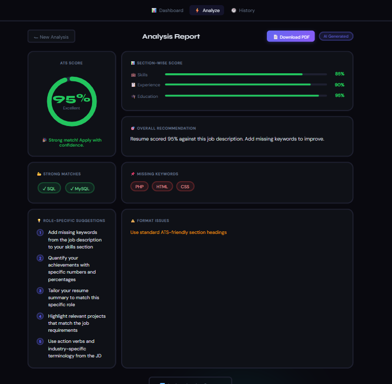

# 🚀 ATS Resume Analyzer

AI-Powered Resume Intelligence System that helps job seekers optimize their resumes for Applicant Tracking Systems (ATS).


## ✨ Features

- **🎯 ATS Score Analysis** - Get instant compatibility score (0-100%)
- **📊 Section-wise Scoring** - Skills, Experience, and Education breakdown
- **💪 Strong Matches** - Keywords present in both resume and job description
- **📌 Missing Keywords** - Identify gaps in your resume
- **💡 Role-specific Suggestions** - AI-generated improvement tips based on the exact JD
- **📄 PDF Export** - Download your analysis report
- **⚡ Real-time Analysis** - Results in under 10 seconds
- **🎨 Premium Dark UI** - Modern, professional interface

## 🛠️ Tech Stack

### Frontend
- **Angular 18** - Modern web framework
- **TypeScript** - Type-safe development
- **RxJS** - Reactive programming
- **CSS3** - Custom dark theme with animations

### Backend
- **Spring Boot 3.3.2** - Java framework
- **Maven** - Build automation
- **Google Gemini AI** - AI-powered analysis
- **Apache PDFBox** - PDF text extraction
- **MySQL** - Database (optional for history)

## 📸 Screenshots

### Upload Screen
Clean, intuitive drag-and-drop interface for resume upload.

### Analysis Results

- Animated score gauge (0-100%)
- Section-wise progress bars
- Color-coded keyword chips
- Role-specific suggestions

### Features Comparison

| Feature | ATSScan | Competitors |
|---------|---------|-------------|
| Section-wise scores | ✅ | ❌ |
| Strong matches | ✅ | ❌ |
| Role-specific tips | ✅ | ❌ |
| PDF export | ✅ | ❌ |
| Dark theme | ✅ | ❌ |

## 🚀 Getting Started

### Prerequisites
- Node.js 18+
- Java 17+
- Maven 3.8+
- Google Gemini API Key

### Installation

#### 1. Clone the repository
```bash
git clone https://github.com/YOUR_USERNAME/ats-resume-analyzer.git
cd ats-resume-analyzer
```

#### 2. Backend Setup
```bash
cd Backand

# Configure Gemini API key
# Edit src/main/resources/application.properties
gemini.api.key=YOUR_GEMINI_API_KEY
gemini.api.url=https://generativelanguage.googleapis.com/v1beta/models/gemini-1.5-flash:generateContent

# Run Spring Boot
mvn spring-boot:run
```

Backend will start on `http://localhost:8080`

#### 3. Frontend Setup
```bash
cd resume-ats-frontend

# Install dependencies
npm install

# Start development server
ng serve
```

Frontend will start on `http://localhost:4200`

## 🔑 Getting Gemini API Key

1. Go to [Google AI Studio](https://aistudio.google.com/apikey)
2. Click **"Get API Key"**
3. Create new API key
4. Copy and paste in `application.properties`

**Free tier:** 60 requests per minute

## 📝 Usage

1. **Upload Resume** - Drag & drop your PDF resume
2. **Paste Job Description** - Copy-paste the target job description
3. **Analyze** - Click "Analyze Resume" button
4. **Review Results** - Get instant ATS score and suggestions
5. **Download Report** - Export PDF for future reference

## 🏗️ Project Structure

```
ats-resume-analyzer/
├── Backand/                    # Spring Boot backend
│   ├── src/
│   │   ├── controller/         # REST API endpoints
│   │   ├── service/            # Business logic
│   │   │   ├── GeminiAIService.java    # AI integration
│   │   │   ├── PdfParserService.java   # PDF extraction
│   │   │   └── AnalysisService.java    # Core analysis
│   │   └── model/              # Data models
│   └── pom.xml
│
└── resume-ats-frontend/        # Angular frontend
    ├── src/
    │   ├── app/
    │   │   ├── components/
    │   │   │   ├── home/       # Landing page
    │   │   │   ├── login/      # Authentication
    │   │   │   ├── navbar/     # Navigation
    │   │   │   └── upload-resume/  # Main analysis page
    │   │   └── services/       # API services
    │   └── styles.css          # Global dark theme
    └── package.json
```

## 🎯 API Endpoints

### POST `/api/resume/analyze`
Analyze resume against job description

**Request:**
```bash
curl -X POST http://localhost:8080/api/resume/analyze \
  -F "file=@resume.pdf" \
  -F "jobDescription=Java Developer with 3 years experience..."
```

**Response:**
```json
{
  "atsScore": 93,
  "skillsScore": 83,
  "experienceScore": 88,
  "educationScore": 93,
  "strongMatches": ["SQL", "MySQL", "Java"],
  "missingKeywords": "PHP, HTML, CSS",
  "suggestions": [
    "Add missing keywords from the job description",
    "Quantify achievements with numbers",
    ...
  ],
  "overallRecommendation": "Resume scored 93% against this job description..."
}
```

## 🧪 How It Works

1. **PDF Extraction** - Apache PDFBox extracts text from resume
2. **Keyword Matching** - Compares resume keywords with JD keywords
3. **AI Analysis** - Google Gemini AI generates:
   - ATS compatibility score
   - Section-wise breakdown
   - Role-specific suggestions
   - Format recommendations
4. **Smart Fallback** - If AI fails, uses rule-based keyword matching
5. **Real-time UI Updates** - Animated score reveal with progress steps

## 🎨 UI Features

- **Animated Score Gauge** - Count-up animation from 0 to actual score
- **Loading States** - 4-step progress indicator during analysis
- **Color-coded Results** - Green (80+), Orange (60-79), Red (<60)
- **Responsive Design** - Works on desktop, tablet, and mobile
- **Dark Theme** - Premium glassmorphism design with ambient orbs

## 🔒 Security

- File size validation (max 5MB)
- PDF-only uploads
- Input sanitization
- CORS configuration
- No data stored (stateless analysis)

## 🚧 Roadmap

- [ ] Resume history tracking
- [ ] Multiple JD comparison
- [ ] Email report functionality
- [ ] Resume builder integration
- [ ] LinkedIn profile import
- [ ] Job role templates

## 🤝 Contributing

Contributions are welcome! Please feel free to submit a Pull Request.

1. Fork the project
2. Create your feature branch (`git checkout -b feature/AmazingFeature`)
3. Commit your changes (`git commit -m 'Add some AmazingFeature'`)
4. Push to the branch (`git push origin feature/AmazingFeature`)
5. Open a Pull Request

## 📄 License

This project is licensed under the MIT License - see the [LICENSE](LICENSE) file for details.

## 👨‍💻 Author

**Chandrakant**

- GitHub: [@YOUR_USERNAME](https://github.com/YOUR_USERNAME)
- LinkedIn: [Your LinkedIn](https://linkedin.com/in/YOUR_PROFILE)

## 🙏 Acknowledgments

- Google Gemini AI for intelligent analysis
- Angular team for the amazing framework
- Spring Boot for robust backend
- Apache PDFBox for PDF processing

## 📞 Support

For support, email your-email@example.com or open an issue in this repository.

---

⭐ **Star this repo if it helped you!** ⭐

Made with ❤️ and ☕ by Chandrakant